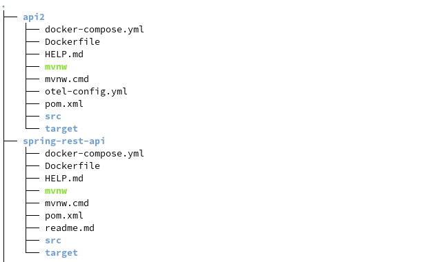

## demarrer avec IDE :
lancer [WladLwe9tApplication.java](src/main/java/io/lacrobate/wladLwe9t/WladLwe9tApplication.java)

l'application est accessible sur {baseUrl}

## démarrer avec docker compose (recommandé)
$ docker compose up -d
prerequis: projet price-api localisé comme spécifié dans docker-compose.yml

## demarrer avec Docker (sans compose) :
- generer le jar dans target
  $ mvn clean package
- creer une image docker 
  $ docker build -t wladlwe9t .
- creer un network "api-network" pour simplifier la communication entre les 2 api contenarisés
  $ docker network create api-network
- demarrer le container
  $ docker run -p 127.0.0.1:8080:8080 --network=api-network --name wladlwe9t wladlwe9t

  "--network=api-network --name wladlwe9t" : section necessaire pour que les 2 containers communiquent

probleme docker ? => [journal]/../software/dockerFaq
## use cases
usecase 0 : statut de l'application
    url : {baseUrl}/rest-api/status 

usecase 1 : recuperer produit 
    prerequis : demarrer price-api
    url : {baseUrl}/rest-api/product/1

## annexe :
{baseUrl} : http://localhost:8080

---
## backlog désiré : 
- ajouter wiremock
- ajouter swagger
- ajouter api observabilite /version (spring-actuator ?) 
- organiser en architecture hexagonale